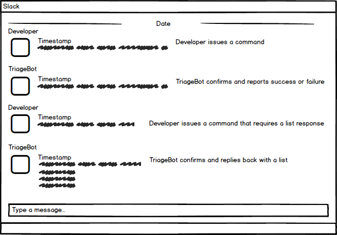
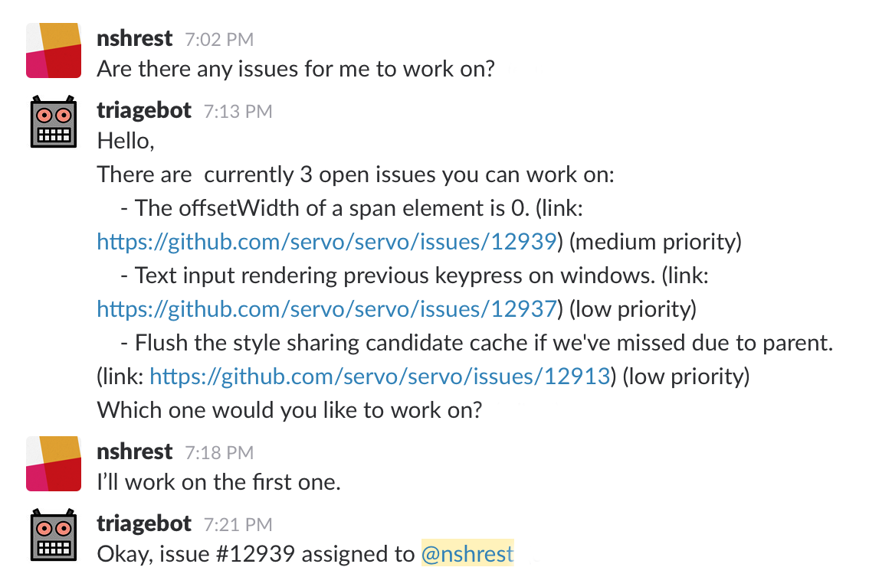
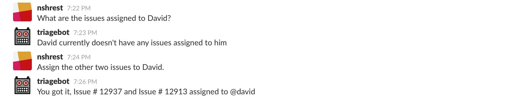
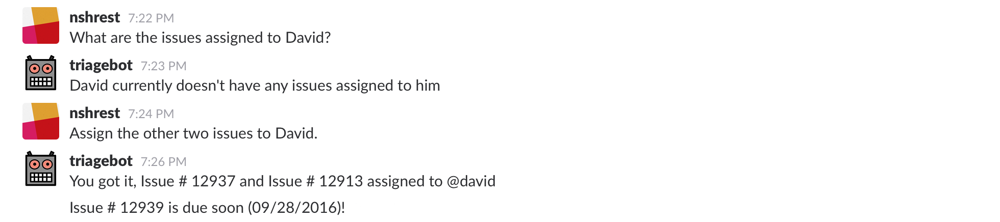
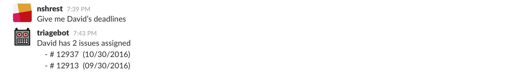

# Design Milestone

### Problem Statement

There is a lot of friction involved in allocating tasks to software developers when working with any project involving multiple members. Why is task allocation a problem? Here are some of the common challenges that afflict software development:

  - Having to manually browse through and delegate the tasks appropriate to the developer
  - Reassigning a task to the next available developer so they can resume the task quickly
  - Making sure all developers have at least one task to do at all times to keep the project moving
  - Giving the developer tasks sorted by priority according to the current sprint deadline

These challenges need to be addressed so that software developers can work efficiently and effectively.

### Bot Description

TriageBot is designed to solve the challenges that were listed above in order to allocate tasks efficiently and appropriately to the developers so tasks are prioritized properly and completed in a reasonable time. To reduce time wasted in manually looking up issues and assigning them to the appropriate developers, the bot will allow the developer to fetch a list of issues sorted by priority with one command. Reassigning a task to the next available developer will also be easy since the bot can provide a list of developers who haven’t been assigned any issues. This will take care of the problem of keeping developers productive by having them work on at least one task at all times. If a developer chooses to delegate a task to another developer, the bot will ask whether the assignee whether they can take on the issue before assigning it. Developers can then accept or reject the issue with a reason so the assigner can find someone else. For maximum productivity, the bot will also be making sure developers are working on higher priority issues for the current sprint, and according to the kinds of issues that they are skilled at solving. The bot will match the issues and the developers based on the history of the types of issues that they have closed out

A bot is a good solution for several reasons: a bot can automatically process background tasks that are tedious for the developers like gathering open issues and sorting them by priority; a bot can converse with the developers to do things step by step in real time, which provides the developer flexibility in assigning tasks or taking on tasks proactively; a bot also serves as a natural interface for developers, which facilitates a conversation based on simple commands as opposed to execution of potentially complicated and unmemorable commands on a terminal. On top of these advantages, a bot that integrates with a popular communication tool like Slack can be very helpful since the developers are already using Slack for most of their communication and they won't have to navigate away from Slack to Github to assign issues and check on deadlines or milestones; developers can make use of the bot to handle task allocation right where the communication is already taking place.

TriageBot would best fit into the <a href="http://willschenk.com/bot-design-patterns/#responders">Responder bot</a> category since it is listening to messages and keeping track of some context regarding the conversation for handling task allocation. The bot will react to messages, which in this case are developer’s requests, and knows who it’s talking to, and can learn from what is being said. For instance, if the developer says they want to work on the first issue instead of the specific issue id number, the bot will understand that it’s the first item. The context would be remembering what was said earlier, such as the developer assigning an issue to themselves.

### Design Sketches

##### Wireframe:

Below is a simple wireframe of the Slack UI which is where the developer will interact with TriageBot.

##### Storyboard:

- Developers can look for open issues and assign them to themselves. The issues will be linked to the respective Github issues. The developer can ask the bot for open issues to work on. He’d use natural language, and the bot would look for keywords like “issue” or “work”. It then understands that the developer is asking for the open issues that fit his expertise.
The bot would then list the issues for the developer and wait for a response. The developer would respond with a phrase that indicates which issue he wants to work on. He would say something like, “I want the first one” or “number 1”.

- Developers can also assign issues to other developers in the team in case they need help with the work that they're currently working on or wanting to delegate tasks to others. Before they start assigning issues, they can also ask TriageBot the issues that the assignee is currently working on to which the bot will respond with a list of issues assigned to that developer. When the developer requests issues to be assignee, the assignee has an option to review the issues before accepting or rejecting the assignment.

- Remembering deadlines can be tough, so TriageBot will also push notifications to the developer with helpful reminders of the deadline for issues. Everyday, the bot will look into the database of issues and based on the milestone of those issues, it can remind the developers at an appropriate time and appropriate frequency.

- Developers can also ask TriageBot for the deadlines of either their issues or other developers in their team. In this case, the developer would make that request in the Slack chat box and the bot would look for keywords including “deadline” or “timeline” along with the name of the developer or the issue’s ID number. The bot then look into the database on Github to pull the information to respond back to the developer’s request. This helps the developer gauge the issues they need to get done, or what other developers are working on before assigning them issues.

### Architecture Design

The bot’s architecture best represents a repository architecture pattern, where the data for developers’ past issues and issue information are being pulled more often than pushed to Github. The frontend of the bot architecture is the Slack UI, which will be used by the developers to communicate and assign issues to each other. Node.js will serve as the backend, making use of a third-party library called BotKit to listen to and process commands issued by the developer and to push notifications and reminders like upcoming deadlines.

The Github REST API is the API Gateway between Node.js and the Github service’s database where the repository for the project is stored. The Node.js script will call the Github REST API to gather information about the open issues and the history of solved issues for the developers and run an algorithm on them and come up with the best possible match.  

For the messages between the bot and individuals, it would be direct messages. The individual can directly message the TriageBot to request issues, check statuses of issues, and other work. The TriageBot with Node.js shall then parse the message and keyword search to find appropriate information in the github database, come down to a suitable decision, and fetch arguments for our function call.  

The initial configuration required by the application would be stored in the xml and will be loaded when the application starts up.

Constraints or guidelines that should be established in building software for your architecture:
- The act of closing an issue means they solved it
- The type of priority of issues include high, medium and low
- Priority level of issues is calculated on deadlines and git issue’s label(s)
- There are fixed number of labels.
- Each individual issue is assigned appropriate label(s) by the developer(s).
- Deadlines looks for issues with attached milestones.

### Additional Design Pattern:
##### Adapter Pattern
It makes one interface compatible with the other or we can that it works as a bridge between two incompatible interfaces.The adapter class will have an instance of the adaptee class and will map its method to the target interface. We are in a way mapping the GitHub Api with the with the chatbots messaging interface. The user will be typing the command/message which will then be converted to a correct set of Api calls to GitHub.

