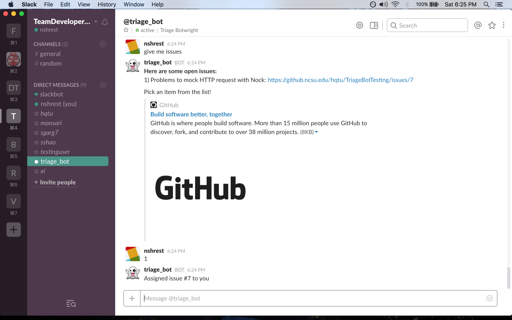
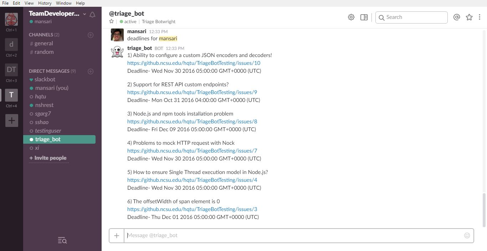
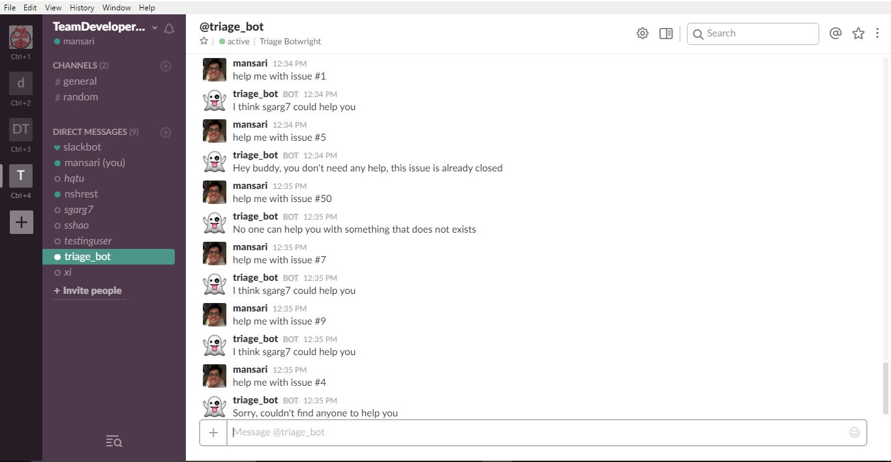

#REPORT MILESTONE

This final report of our Triage bot project contains (1) a description of the problem the bot solves, (2) the bot's primary features, (3) the development process of the bot, and (4) some limitations and future work for our bot. 

##The Problem:

Assigning bugs to developers is a time consuming task which wastes precious and expensive developer hours. The ability to assign and suggest similar and suitable issues along with the ability to recommend experienced developers for help to the user is an essential core of our bot. 

##Primary Features And Screenshots:

- Fetch open issues that are matched to the developer based on the experience of working with similar issues in the past. (Compares closed issue of the developer with the current open issues and ranks them)

 
 
- Get a developer’s deadlines when assigning issues based on milestones and assign issues to developers that have no issues to work on. (Fetches a list of open issues for the developer, If no such issues exist then bot suggests to assign them some of the open issues.)

 

- Recommend experienced developers that can help with the issue you are working on. (Compares the issue for which the help is asked with all the closed issues and recommends names of developers who might be able to help)

 

##Development Process:

The project development was a great learning experience. We all improved several skills throughout the milestones: 

1. Framing the problem and designing the appropriate solution to it
2. Integrating with the bot platform for our bot and developing the interaction component of it using mock data and services
3. Implementing the internal logic required to actually perform the services/tasks via the bot, and
4. Deploying the final version of our bot for use in Slack through Ansible on Amazon Web Services EC2. 

In the beginning of the project, with the slack of knowledge about the tools/technologies and experience with bot making, the development was a bit slow. After researching and gathering information about alternatives and technogies that are most suited to implement the bot, the process accerlerated steadily. The development process was agile, as we had to constantly change the requirements of our bot to solve the problem of task allocation. The team was flexible and ready to switch gears and change the approach of how the bot should process the commands and handle edge cases. In every team meeting, we would look at the current state of the bot and create a list of known bugs and new features that needed to be added. We would then prioritize and fix a deadline for a portion of the high priority tasks, evaluate the new functions of our bot, and then repeat the whole process again in an iterative fashion. When faced with difficult programming tasks that required lots of refactoring, the team engaged in pair programming, where the driver made the required changes and the navigator corrected mistakes and guided the driver.

##Limitations And Future Work:

With the scope of the project and the time constraints, even though our bot provides solutions to the task allocation problem, it can definitely be improved in terms of performance and flexibility in different environments. There are several limitations and potential enhancements that should be considered for future work.

Limitations:
- The inability to associate two issues if they have different names, labels and description. 
- Currently, there is no way to reset or change the github username, this could be easily added for future iterations.
- The bot only works with Github for task/work assigning and tracking.
- For issue matching, the bot just compares past closed issues while trying to help a developer.

Future work:
- Issue matching algorithm can be improved by applying different machine learning algorithms so the results are more accurate which would need a bigger dataset for training the models and testing them.
- Factoring in some form of timesheet/calendar would be useful to know which developers are not assigned to any issue and will have free time in near future.
- For interaction, the bot could be more user friendly and seamless through improving the oboarding experience of entering the developer's name and github username to interact with the bot; in the future, we can map github names with actual names automatically. 
- For environment, possibly extend work assigning to other task tracking softwares like JIRA and many more.
- For issue matching, extend it to look into crowd documentation or other relevant sources as well.

## Acknowledgement: 

We want to thank Dr. Chris Parnin (cjparnin@ncsu.edu), Assistant Professor at North Carolina State University, and the TAs including Xi Yang (yxi2@ncsu.edu) and Shudi Shao (sshao@ncsu.edu) for their support and guidance throughout this specific project. 
